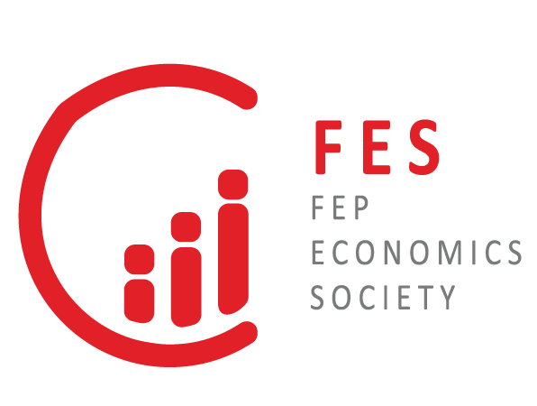

# afonso31416.github.io
<!DOCTYPE html>
<html lang="en">
<head>
  <meta charset="UTF-8" />
  <meta name="viewport" content="width=device-width, initial-scale=1.0" />
  <title>FEP Economics Society</title>
  <link rel="preconnect" href="https://fonts.googleapis.com" />
  <link rel="preconnect" href="https://fonts.gstatic.com" crossorigin />
  <link href="https://fonts.googleapis.com/css2?family=Montserrat:wght@400;500;600;700;800&display=swap" rel="stylesheet" />
  <link rel="stylesheet" href="assets/css/styles.css" />
</head>
<body>
  <header class="topbar">
    

      

      <button class="menu-toggle" aria-expanded="false" data-en="Menu" data-pt="Menu">Menu</button>

      

        <nav class="nav-links">
          <a class="active" href="index.html" data-en="Home" data-pt="Inicio">Home</a>
          

            
About Us

            

              <a href="team.html" data-en="Meet Our Team" data-pt="Conhece a Equipa">Meet Our Team</a>
              <a href="our-mission.html" data-en="Our Mission" data-pt="A Nossa Missao">Our Mission</a>
            

          

          

            
Projects

            

              <a href="newsletter.html" data-en="Newsletter" data-pt="Newsletter">Newsletter</a>
              <a href="fes-union.html" data-en="FES Union" data-pt="FES Union">FES Union</a>
              <a href="semana-orcamento-estado.html" data-en="State Budget Week" data-pt="Semana do Orcamento de Estado">State Budget Week</a>
              <a href="other-events.html" data-en="Other Events" data-pt="Outros Eventos">Other Events</a>
            

          
</nav>
        

          <button id="btn-en" class="active">EN</button>
          <button id="btn-pt">PT</button>
        

      

    

  </header>

  <main>
    <section id="home-hero" class="hero hero-home">
      

        

        

      

      

        

          <h1 data-en="FEP Economics Society" data-pt="FEP Economics Society">FEP Economics Society</h1>
          
Estudar, Educar e Debater Economia

          

            A student-run society at FEP focused on economic literacy, policy debate, and practical knowledge through publications and events.
          

          

            <a class="btn btn-primary" href="team.html" data-en="Meet Our Team" data-pt="Conhece a Equipa">Meet Our Team</a>
            <a class="btn btn-outline" href="newsletter.html" data-en="Explore Projects" data-pt="Explorar Projetos">Explore Projects</a>
          

        

      

    </section>

    <section id="main-projects">
      

        <h2 class="section-title" data-en="Main Projects" data-pt="Projetos Principais">Main Projects</h2>
        

          <a class="card card-link" href="newsletter.html">
            <h3 data-en="Newsletter" data-pt="Newsletter">Newsletter</h3>
            

              Regular articles on current macroeconomic and policy topics, written by students and invited contributors.
            

          </a>

          <a class="card card-link" href="fes-union.html">
            <h3 data-en="FES Union" data-pt="FES Union">FES Union</h3>
            

              A collaboration platform that strengthens internal teamwork and turns ideas into concrete initiatives.
            

          </a>

          <a class="card card-link" href="semana-orcamento-estado.html">
            <h3 data-en="State Budget Week" data-pt="Semana do Orcamento de Estado">State Budget Week</h3>
            

              An intensive week dedicated to understanding the Portuguese State Budget through talks, analysis, and debate.
            

          </a>

          <a class="card card-link" href="other-events.html">
            <h3 data-en="Other Events" data-pt="Outros Eventos">Other Events</h3>
            

              Conferences, roundtables, and workshops connecting economics with real institutions and careers.
            

          </a>
        

      

    </section>

    <section id="society-numbers">
      

        <h2 class="section-title" data-en="FES in numbers" data-pt="A FES em números">A FES em númeors</h2>
        

          

            <strong>60+</strong>
            Active Members
          

          

            <strong>25+</strong>
            Events per Year
          

          

            <strong>12</strong>
            Newsletter Editions
          

          

            <strong>1</strong>
            Mission: Economic Impact
          

        

      

    </section>

    <section id="subscribe-newsletter">
      

        

          

            
          

          

            <h3 data-en="Subscribe to the Newsletter" data-pt="Subscreve a Newsletter">Subscribe to the Newsletter</h3>
            

              Receive each monthly edition directly in your inbox.
            

            <form id="subscribe-form" class="subscribe-form" action="#" method="post">
              <label class="sr-only" for="newsletter-email" data-en="Email address" data-pt="Endereco de email">Email address</label>
              <input id="newsletter-email" name="email" type="email" required placeholder="your.email@example.com" />
              <button type="submit" data-en="Subscribe" data-pt="Subscrever">Subscribe</button>
            </form>
            

          

        

      

    </section>

  </main>

    <footer>
    

      

        <h4 data-en="FEP Economics Society" data-pt="FEP Economics Society">FEP Economics Society</h4>
        
Porto, Portugal

      

      

        <h4 data-en="Navigation" data-pt="Navegacao">Navigation</h4>
        <a href="index.html" data-en="Home" data-pt="Inicio">Home</a>
        <a href="team.html" data-en="Meet Our Team" data-pt="Conhece a Equipa">Meet Our Team</a>
              <a href="our-mission.html" data-en="Our Mission" data-pt="A Nossa Missao">Our Mission</a>
        <a href="newsletter.html" data-en="Newsletter" data-pt="Newsletter">Newsletter</a>
        <a href="other-events.html" data-en="Other Events" data-pt="Outros Eventos">Other Events</a>
      

      

        <h4 data-en="Index Sections" data-pt="Secoes da Pagina Inicial">Index Sections</h4>
        <a href="index.html#home-hero" data-en="Hero" data-pt="Capa">Hero</a>
        <a href="index.html#main-projects" data-en="Main Projects" data-pt="Projetos Principais">Main Projects</a>
        <a href="index.html#society-numbers" data-en="Society in Numbers" data-pt="Sociedade em Numeros">Society in Numbers</a>
        <a href="index.html#subscribe-newsletter" data-en="Subscribe" data-pt="Subscricao">Subscribe</a>
      

      

        <h4 data-en="Placeholder" data-pt="Espaco Reservado">Placeholder</h4>
        
Coming soon...

      

    

  </footer>

  
</body>
</html>

